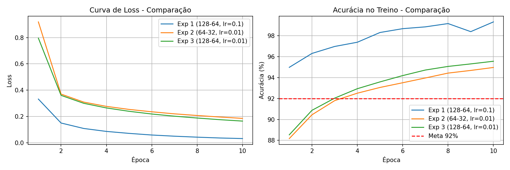
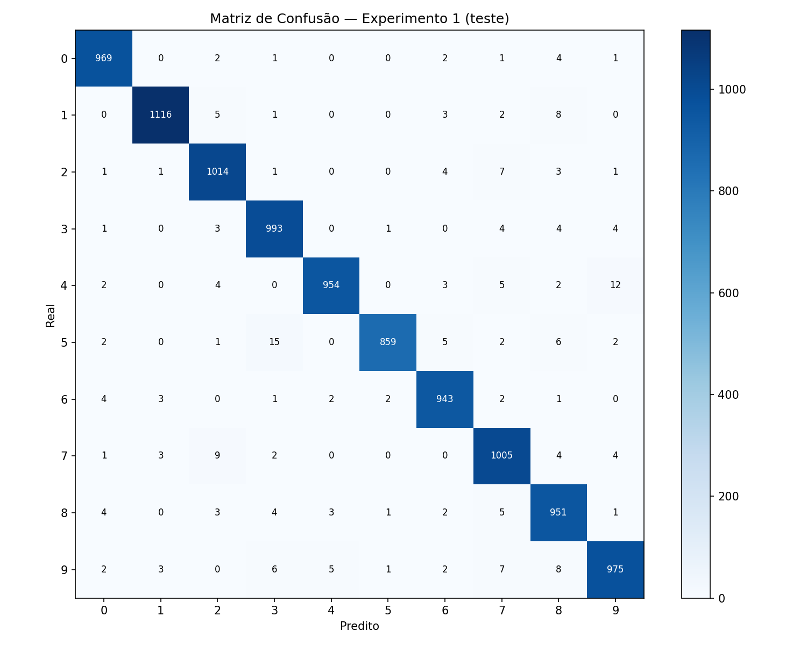

# MLP do Zero — Classificação de Dígitos com MNIST


Este projeto apresenta a implementação de uma rede neural do tipo Multi-Layer Perceptron (MLP) desenvolvida do zero utilizando apenas NumPy para operações matriciais.

O objetivo foi compreender e implementar manualmente os principais componentes de uma rede neural, incluindo:

* Forward Pass;
* Funções de ativação;
* Funções de perda;
* Backpropagation;
* Atualização dos pesos por Gradient Descent;
* Treinamento com Mini-Batches.

A implementação foi inicialmente validada no problema XOR e posteriormente aplicada ao dataset MNIST para classificação de dígitos manuscritos.

### Dataset

Foi utilizado o dataset MNIST, composto por:

* 60.000 imagens para treinamento;
* 10.000 imagens para teste;
* 10 classes (dígitos de 0 a 9);
* Imagens em escala de cinza com dimensão 28 × 28 pixels.

Durante o pré-processamento, as imagens foram convertidas para vetores de 784 atributos e os valores dos pixels foram normalizados para o intervalo [0,1]. Os rótulos foram convertidos para o formato One-Hot Encoding.

## Como executar

### 1. Criar ambiente virtual

```bash
python -m venv .venv
source .venv/bin/activate
```

### 2. Instalar dependências

```bash
pip install -r requirements.txt
```

### 3. Executar os experimentos

O notebook principal encontra-se em:

```bash
notebooks/experimentos.ipynb
```

## Arquitetura escolhida

A arquitetura `784 → 128 → 64 → 10` foi escolhida após os experimentos realizados.

As duas camadas ocultas atendem ao requisito mínimo da atividade e fornecem capacidade suficiente para aprender os padrões presentes no MNIST. A função ReLU foi utilizada nas camadas ocultas por reduzir problemas de gradientes muito pequenos e acelerar o treinamento. Já a camada de saída utiliza Softmax, permitindo interpretar as saídas da rede como probabilidades para cada uma das 10 classes.

Para inicialização dos pesos foi utilizada a técnica de He initialization, recomendada para redes com ReLU. Ela escala os pesos iniciais por sqrt(2/n),compensando o fato de que a ReLU zera metade dos neurônios e evitando que as ativações encolham camada a camada.


## Resultados

| Métrica            | Melhor resultado |
| ------------------ | ---------------- |
| Acurácia de treino | 99.3%            |
| Acurácia de teste  | 97.79%           |
| Loss final         | 0.0313           |

O modelo superou a meta mínima de 92% de acurácia estabelecida para a atividade. O melhor modelo alcançou 97.79% de acurácia no conjunto de teste, aproximadamente 5.8 pontos percentuais acima da meta exigida.

### Experimentos realizados

Três experimentos foram conduzidos para analisar o impacto da arquitetura da rede e do learning rate.

| Experimento | Arquitetura   | Learning Rate | Acurácia Teste |
| ----------- | ------------- | ------------- | -------------- |
| 1           | 784→128→64→10 | 0.1           | 97.79%         |
| 2           | 784→64→32→10  | 0.01          | 94.73%         |
| 3           | 784→128→64→10 | 0.01          | 95.31%         |

Os resultados mostraram que o learning rate teve maior influência sobre a velocidade de convergência e o desempenho final do modelo do que a redução da arquitetura avaliada.



### Matriz de confusão



Os erros mais frequentes ocorreram entre dígitos morfologicamente parecidos:
5→3 (15 casos), 4→9 (12 casos) e 7→2 (9 casos).

## Decisões e dificuldades

### 1. Qual foi a decisão técnica mais difícil que você tomou? Por que fez essa escolha?

A decisão mais difícil foi escolher a arquitetura e os hiperparâmetros da rede. No início eu não tinha muita noção de quantos neurônios utilizar nem qual learning rate seria o mais adequado. Durante os testes percebi que pequenas mudanças nesses parâmetros alteravam bastante o comportamento do treinamento. Por isso, optei por realizar experimentos comparando diferentes arquiteturas e valores de learning rate. Isso me ajudou a entender melhor o impacto de cada escolha e chegar a uma configuração que apresentasse boa acurácia no conjunto de teste.

### 2. O que você tentou que não funcionou? O que aprendeu com isso?

Antes do MNIST, validei a implementação utilizando o problema XOR e nessa etapa encontrei várias dificuldades.

Com learning rate igual a 0.1 e apenas dois neurônios ocultos, a loss permanecia próxima de 0.693 durante todo o treinamento e a rede praticamente não aprendia. Ao analisar os gradientes, percebi que eles estavam ficando muito pequenos. Também testei um learning rate igual a 10. Nesse caso a rede chegou a aprender parte do problema, mas ficava presa em uma solução ruim e não conseguia classificar corretamente todos os exemplos do XOR.

Esses testes me ajudaram a entender que uma implementação correta do backpropagation não garante bons resultados sozinha. A escolha da arquitetura e dos hiperparâmetros também tem papel fundamental no treinamento.

### 3. Se fosse refazer do zero, o que faria diferente?

Se fosse desenvolver o projeto novamente, eu faria mais experimentos controlados desde o início, alterando apenas um hiperparâmetro por vez. Isso teria facilitado a análise dos resultados e a identificação das causas de cada mudança de desempenho, o que facilitaria também na melhora do modelo.

Também implementaria um gradient check numérico para validar os gradientes logo no começo do desenvolvimento, o que aumentaria minha confiança na implementação antes de avançar para o MNIST.


## Estrutura do repositório

```text
.
├── README.md
├── mlp/
│   ├── __init__.py
│   ├── activations.py    ← funções de ativação e suas derivadas
│   ├── losses.py         ← cross-entropy e outras
│   ├── network.py        ← implementação do MLP
│   └── optimizers.py     ← SGD e opcionais
├── notebooks/
│   ├── xor_test.ipynb
│   └── experimentos.ipynb
├── results/
└── requirements.txt
```
